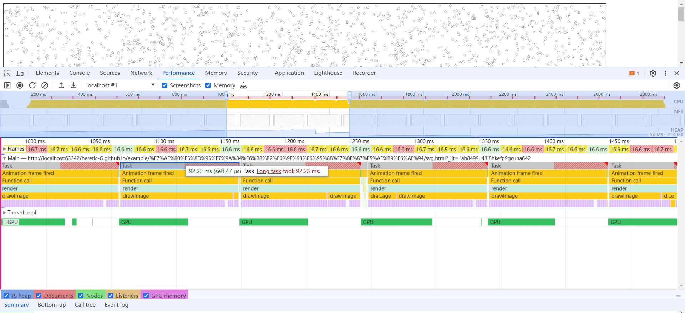
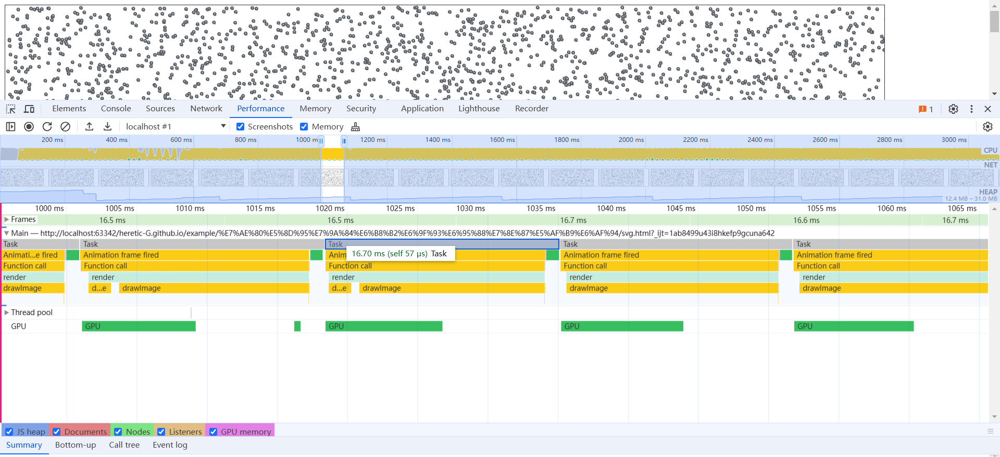
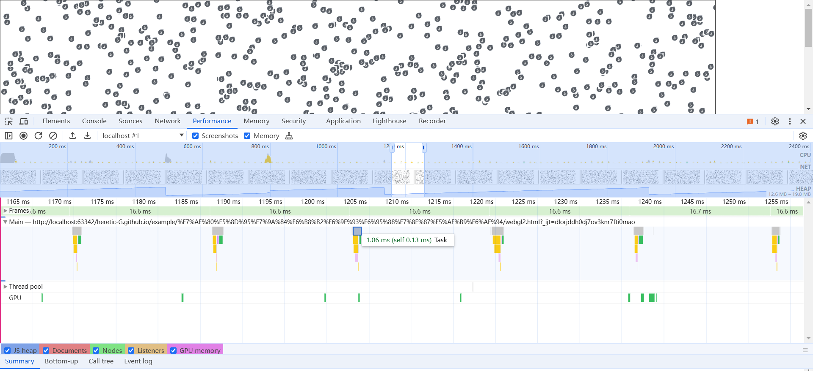
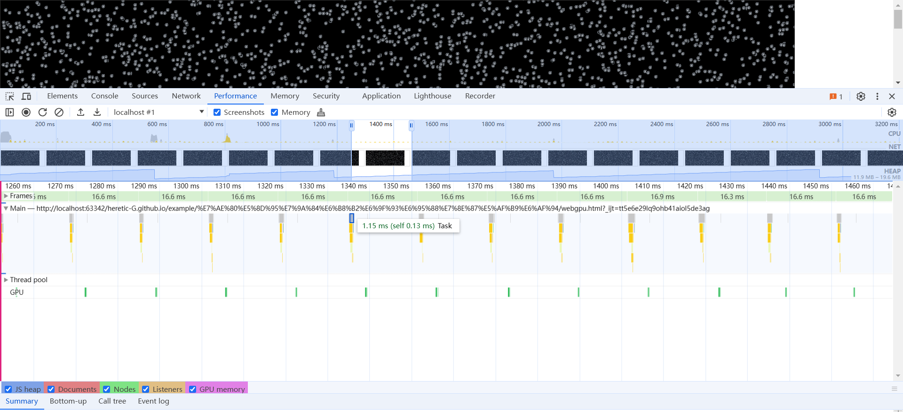

5个示例 分别是 svg cpu的ImageBitmap gpu的ImageBitMap webgl webgpu

在canvas的情况下svg一定慢于png这种 但是同样的png和imageBitMap 差距不会很大 因为前者涉及矢量转成标量 但是imageBitMap存在的差异是存储位置 gpu的是相对少了commit的耗时
webgl和webgpu更快 因为减少display list同步到gpu

下图svg的渲染耗时

下图png的渲染耗时

下图cpu的ImageBitmap的渲染耗时

下图gpu的ImageBitMap的渲染耗时

下图webgl的渲染耗时

下图webgpu的渲染耗时

------
下面是以前总结的

bitMap 使用渲染应该是最快的

两种方式 window?.OffscreenCanvas和window?.createImageBitmap

存在比较大的区别 在返回数据俩看都是ImageBitMap 这些都是一致的但是在存储位置上会存在区别 OffscreenCanvas都在GPU进程中

createImageBitmap是在主线程的内存中

这里的问题就是OffscreenCanvas如果因为默认的一些硬件加速或者GPU加速 导致GPU的崩溃 GPU内存就没了 需要自己做监控和数据恢复

createImageBitmap就没有这个问题 如果主线程崩溃 也就结束了 这里内存不是在performance.memory中记录 只能自己去推测

主线程的内存限制小于GPU内存限制(我的电脑4w 300*300 bitMap 直接内存爆掉 但是GPU可以容纳8w个 300*300 bitMap还没崩， 实际内存超过一定限制会做压缩或者虚拟内存这些)

如果基于OffscreenCanvas的bitMap是不可以直接createImageBitmap的 因为内存没有变化到主线程中 需要转成blob在create才可以移交出来

浏览器任务管理器展示内存是应该占用的不是实际的从系统任务管理器中可以看到

如果重度使用存储主线程bitMap最好封装一层做内存管理或者做GPU内存做GPU的崩溃监控和数据还原

bitMap在存储的时候如果是类型Map直接clear可能一段时间内数据不会被回收 但是如果直接整个数据 null 放弃引用这里会被立刻回收

如果直接close会立刻被回收

看到个人说他的没有回收 这里不确定是浏览器修复还是其他的问题闭包导致的判断逻辑问题 建议bitMap全部都按照标准的close方案先释放在清楚引用关系

目前看上面都是canvas的2d模式渲染的对比 webgl会不会有更好的效果？

chrome://gpu/

1	chrome://badcastcrash
2	chrome://crash	崩溃
3	chrome://crashdump
4	chrome://kill
5	chrome://hang
6	chrome://shorthang
7	chrome://gpuclean
8	chrome://gpucrash	gpu崩溃，黑屏
9	chrome://gpuhang	gpu挂起，页面卡死
10	chrome://memory-exhaust
11	chrome://ppapiflashcrash
12	chrome://ppapiflashhang
13	chrome://quit/	关闭
14	chrome://restart/	重启
