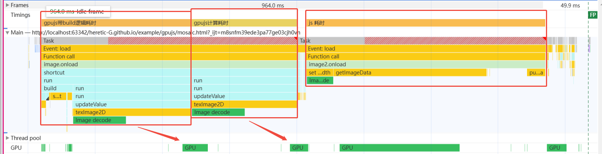

gpujs

实际就是利用webgl来调用GPU进行gpgpu(图形处理器通用计算)行为 实际在demo中存在很多限制 首先就是所有的内核函数需要构建时间 数据需要通过纹理传到gpu 然后计算完了
在回传回来

这里前面是相同方法的两次调用 第一次需要build  我直接调用build方法 看了下还需要传递参数 感觉这里不合理 可以提前构建build 只是也需要包裹一层 不过在实际中应该这里和函数体积也相关

纯js的逻辑实际大多数在前置和后置逻辑中 纯js逻辑运算也不慢 gpu的计算没看到具体的优势 目前看大概率和gpu的上下文创建调用相关 也就是使用耗时门槛很高