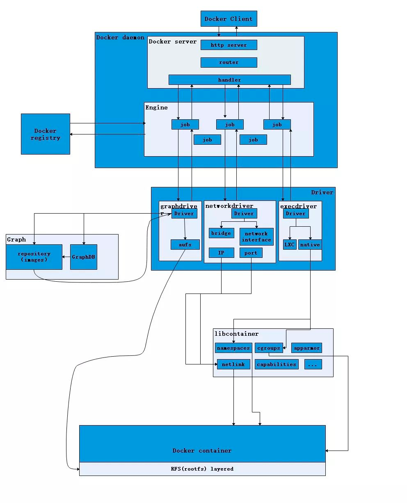

虚拟机都需要在虚拟化硬件上面在启动完整的操作系统在再上面去跑应用

#### namespace

pid、net、ipc、mnt、uts、user 使用namespace来做到隔离

#### cgroups

他其实就是一个文件的接口去控制资源配额和度量

#### Union FS

他其实就存在层的概念 正常docker 利用bootfs来引导kernel 后直接卸载了 所有的linux其实kernel都差不多 所以其实是公用的
镜像就是多个只读层 然后container 就是一个可写层 因为下面只读 所以可以公用

parent image base image

这里感觉我也是一知半解

这里可以看 client其实就是cli发命令发送到server 这里会处理变为job去 后面更详细的可以有兴趣和需求再去看

layer实际是每个命令都会创建一个层 

但是大多数都是size = 0 这时候其实实际不会出现这个层 但是有个例外 workdir 如果不是/ 也会创建一个有效的layer

但是从history看这里是size = 0的

基本命令

dockerfile 指令

