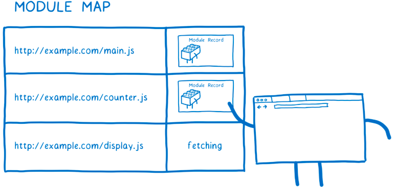
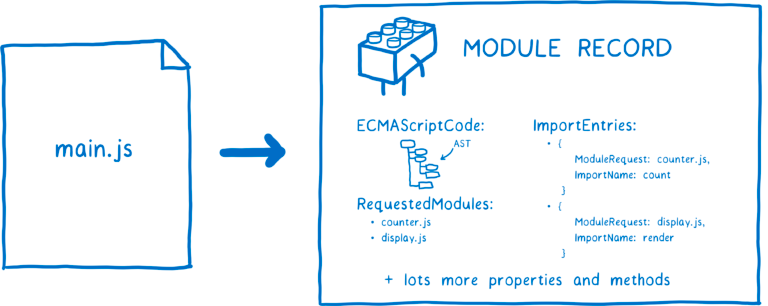

讲esm不错的文章[文章](https://hacks.mozilla.org/2018/03/es-modules-a-cartoon-deep-dive/)

为什么需要模块化  以前都是把依赖放到了全局这里的问题是 所有人都在这里 当这里不存在会直接报错 
任何人都可以改他 导致存在安全问题

common.js 

使用require module.exports exports.[key] 来设置

当我们直接require的时候拿到的就是exports的值 这里在值上面都是复制 

整体流程是这样的先是 a.js b.js 加载一个模块的时候 会看看是不是加载过 没有会创建一个obj 
```javascript
{
    i: moduleId,
    l: false,
    exports: {}
}
```
在这里a依赖b会给b也创建 在创建后b依赖a 因为存在所以直接使用(但是这时候存在的a的值 只存在到b这之前的值 然后b直接执行完 再回到a中)

esm 

这里拆分成3步 Construction-Find(构建-查找) -> Instantiation(实例化) -> Evaluation(评估)

Construction-Find 从哪里下载 根据url获取文件 生成module record

module map

Instantiation

code + state  这时候只有导出的fun会先初始化

module environment record 使用living binding 让不同模块都指向相同的内存

---
cjs 同步阻塞 cjs 有个map 

esm 异步

- Construction-Find 这里是个module map key是url value是module record 这里最开始是fetching 然后解析成module record
- Instantiation 这里会生成一个module environment record 里面会记录我们需要啥变量 但是这里还没有值 这里是DFS后序遍历 这里使用了live binding 所以即使在不运行代码也能连接所有的module 这也就是esm解决循环依赖的方法
-  

#### module map 

#### module record


#### 