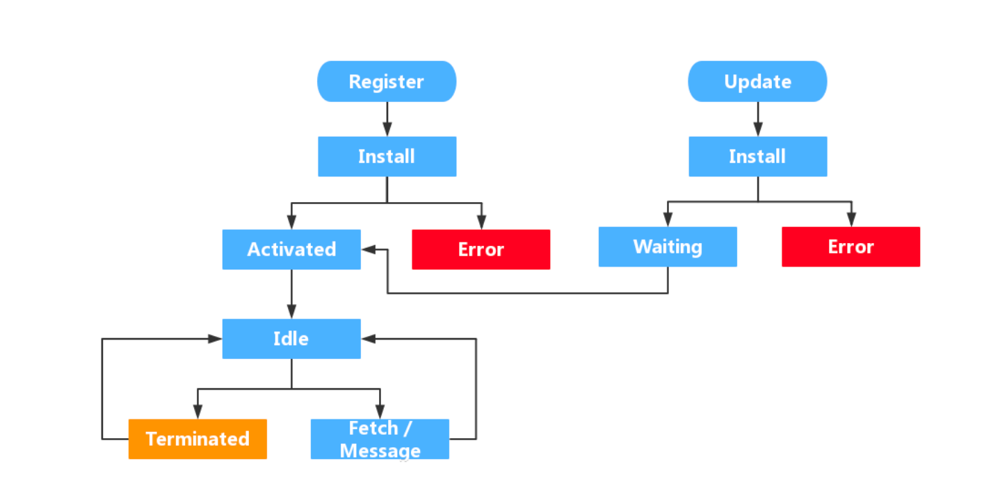

#### service worker 

原本应该单独记录在一个文章中的 但是和之前的一个demo其实差不多 或者在这个上面我还没有啥别的经验 内容不多记录在一起

// 记录一个坑...sw有scope 默认是静态资源的地址 所以最好是sw.js 这样才是最大的scope 不然...哎 最主要是在最外面还能看到他成功了 
我还说怎么捕获不到fetch

service worker 基本分为这几个流程 

大多数其实是在做离线能力 这里也就是网上最多的demo 在install中去获取全量的资源去生成缓存 然后在fetch的时候返回缓存 这里有个逻辑是html需要主动去请求
在fetch中也是没有html的但是在离线的时候这里会抛出来一个html这里是为了html击穿缓存保证正常的逻辑

所以sw的能力本身就是那几个点 能拦截fetch 能修改response或者request 可以理解是一个单独的层去操作网络请求 还有后台同步 我觉得很多说到sw就是缓存的是不正确的
实际在大多数使用的场景更多是静态资源这里的缓存策略不会命中他 因为现在都是hash+max-age 这里在fresh中并不会发出请求也就没有到fetch 

那如果说是缓存更多感觉可以使用来做api的缓存 在header中增加自定义的头 sw中拦截请求存在头就直接cache下来 标记过期时间 这里的好处在于他本身就是独立的

service worker 的更新如果不是无脑skipWaiting 

那就需要一个强制的更新逻辑 无论是需要提示用户还是一个强制的更新都是需要这样的一个逻辑

因为service worker只有在全部tab都关闭才可以 正常是不能靠刷新去更新的

那实现的基本方式就是在除了active的service worker 的逻辑中 去提示用户或者得到用户同意后去service worker

调skipWaiting之后再调用reload 就好了

目前还有2个逻辑需要优化 第一个就是如果存在一个waiting 但是可能还有一个installing这里需要做处理

还有就是多个tab的时候需要只刷新一个或者一个统一全部同步刷新
