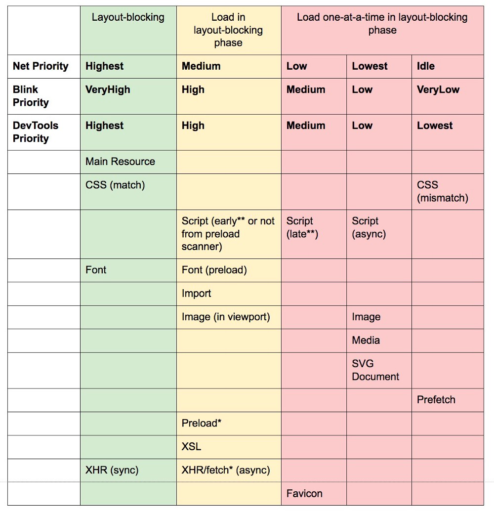
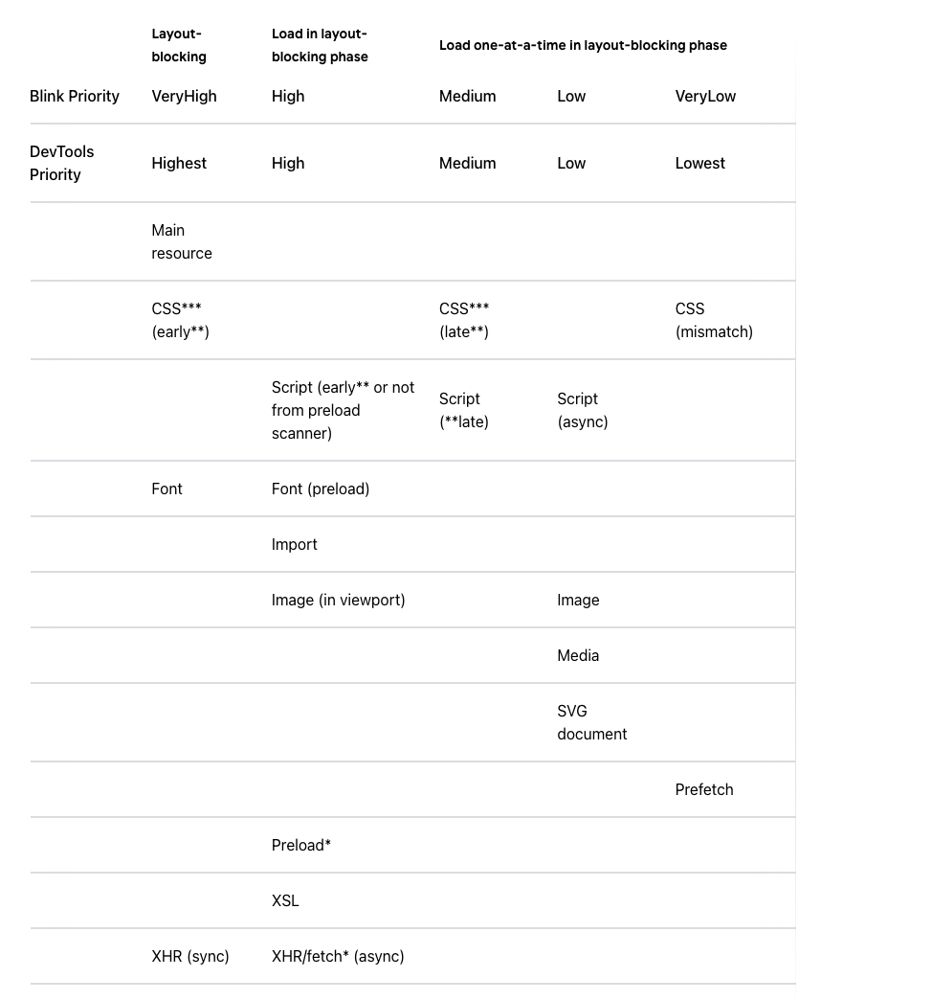

1. Navigation Timing 和 Resource Timing
2. Page Lifecycle 

[https://developers.google.com/web/updates/2018/07/page-lifecycle-api](https://developers.google.com/web/updates/2018/07/page-lifecycle-api)
[https://mathiasbynens.be/notes/shapes-ics](https://mathiasbynens.be/notes/shapes-ics)
[https://www.chromium.org/developers/design-documents/displaying-a-web-page-in-chrome](https://www.chromium.org/developers/design-documents/displaying-a-web-page-in-chrome)
[https://chromium.googlesource.com/chromium/src/+/refs/heads/main/docs/threading_and_tasks.md#Posting-to-a-New-Sequence](https://chromium.googlesource.com/chromium/src/+/refs/heads/main/docs/threading_and_tasks.md#Posting-to-a-New-Sequence)
[https://www.chromium.org/developers/design-documents](https://www.chromium.org/developers/design-documents)

1. 搜索内容输入中只会当成搜索内容 进行对应的预查询 这时候即使你输入了协议域名等完整的URL也是当成搜索内容 这一步不会进行pre dns等基于url的优化 
2. 内容解析 这一步会确定是搜索内容还是url 如果是搜索内容这里就跳转到对应的搜索引擎拼接参数(搜索内容) 
3. 如果是url 先进行 HSTS (不补充协议 默认是https)如果非https查看HSTS (内部HSTS的列表也要看下是不是匹配 不然会触发一个本地307) 
4. 检查缓存 （这里是内容缓存 内容缓存目前key是3个依赖same site）
5. 建立DNS DNS的几层缓存 本地是递归  本地到获取真实的是迭代 不然根服务器扛不住 
6. TCP连接 TLS连接
7. 请求数据 html 来了后会开始解析dom 这时候会粗扫一遍dom 直接pre-fetch

#### defer、async、module

- module就是defer 动态添加的script的脚本就是async 这里默认是true
- defer和async都是并行下载 在下载中不会阻塞解析html
- 但是defer整体是有序的而且在html解析完后直接顺序运行 然后在执行DOMContentLoaded 所以这里可能会阻塞 DOMContentLoaded事件的发生
- async 这玩意都是各自为战了 下完了直接阻塞运行 这里唯一要知道的是 onload是在所有之后 所以async会阻塞onload事件

#### css js
- css不会阻塞dom解析
- css会阻塞dom渲染
- css会阻塞正常的js运行 所以这里defer可以保证dom是加载好的 但是这时候的css属性不一定是最新的 正常js能保证他的上面的css是最新的下面
- js(正常)下载会阻塞解析和渲染 js运行全部都阻塞解析和渲染

#### preload、prefetch、dns-prefetch、preconnect 、prerender Subresource

#### 优先级 资源优先级分为 5级

Highest High Medium Low Lowest 

顺序也可能导致优先级变化 可以使用as去改变优先级

Compile Code

Parse HTML

Layout

Paint

Recalculate Style(重新计算样式)

Schedule Style Recalculation 

Update Layer Tree 更新层树

Compute Intersections 计算交叉点

Composite Layers

Hit Test

