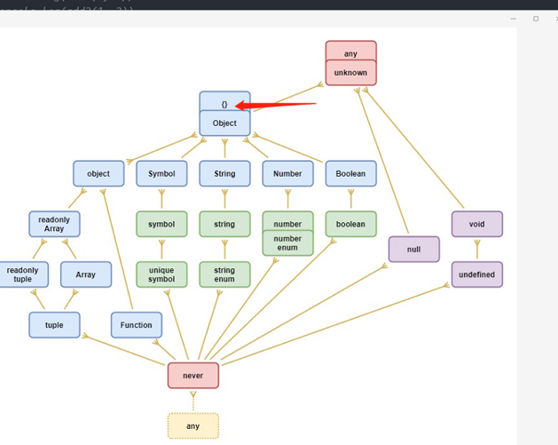

静态类型检测  所以即使在推断时 也会按照静态去做处理

```typescript
let demo = Math.random() > 0.5 ? "hello" : [0]
```

demo的类型是string|number[] 而不是其中一个 这里就会出现变量空间是一个 但是类型空间是更大的范围的情况

noImplicitAny 推断为any的报错

strictNullChecks undefined和null的检测报错


图片引用自[github](https://gist.github.com/laughinghan/31e02b3f3b79a4b1d58138beff1a2a89)

这张图基本囊括了ecma中的基本类型了 

还包括 

- Union Types 联合类型 |
- Optional Properties 可选属性 ?
- Type Assertions 类型断言 as 只能到一个更具体或者更不具体的类型 而不能直接跨类型
- Literal Types 就是string的'dasd' 这种具体的类型
- Non-null Assertion Operator 非空断言 ! 断定当前不会是 null或者undefined
- Enums 枚举 枚举的问题在于 在类型中 允许了number 而不是限制住本身存在的number 导致默认行为只有0-3 但是我使用4也不会报错 当然可以全部填充string 以至于只能使用枚举本身才可以匹配
- bigint number里面的一种扩展

boolean 是 true | false 的别名

type 类型别名 扩展上只能是通过 & 命名后不能再变更

interface 可以通过extends扩展 变更直接interface 可以直接扩展 但是不能直接扩展原始类型

#### 收窄
类型收窄 应该是最基本的功能了因为我们大多数在使用的时候都是从一个宽泛类型到一个具体的去做操作 

    一般if/else typeof
    && || !
    switch === == !== !=
    in
    instanceof
    Assignments 变量分配可以让其收窄类型
    一些控制流收窄if else 等一些逻辑中 会根据不同的逻辑去收窄类型
    使用类型谓词 is
    discriminated union 可分区联合
    当分区到一个无属性的会使用never来当做类型
    Exhaustiveness checking 穷尽检查可以去检查一个类型所有的状态 以至于最后一个状态是never 如果这时候增加一个状态 会报错用来提示开发者这里需要处理多的联合类型以保证代码不会出错


#### Function

Function Type Expressions 也就是最近基本的函数类型声明

```typescript
function demo (data: string): number {
    return Number(data)
}
```
如果函数存在方法可以使用type interface
```typescript
type demo = {
    (data: string): number
}
const demo:demo = function demo (data) { return Number(data)}

type demo = {
    new (data: string): {data: string}
}

function createCtor (fun:demo) {
    return new fun('hello')
}

```

Generic Functions

很多返回依赖输入 

泛型函数 依赖传入参数类型推导可以约束泛型 可以默认值泛型 约束的本身不是设置类型 而是设置最基本的类型范围

泛型函数的泛型类型优先级目前是分割的 

也就是传入参数会导致所有的参数都是传入的这时候没有传入并没有默认值会报错 要么都是从参数上去获取进行extends的约束

函数重载基本就是从上到下的匹配 所以需要不断的更宽泛可以是类型 也可以是参数个数 他会直接使用第一个能够匹配上的

参数名称ts并不关心 他只关心个数和类型 

而且实现的签名还需要和重载的签名兼容

函数中声明this
```typescript
function demo (this: {name: string}) {}
```

直接放在最开始就好了

void 当做函数返回值的时候 js中相当于return undefined 但是在ts中存在差异就是void可以返回任何事物 
但是返回的变量对应的类型空间的值都是void

object

属性 可选 必选 默认带+ 想要去掉用-

可以设置key的类型 只能是string number symbol 

所有的都是readonly是父类 可变的是子类 可以理解为可变的内容是扩展了在操作上的行为 

元组的readonly 
```typescript

type tuple  = readonly [string, number]
```


Generics

泛型应该就是比较灵活一块 文档其实没讲啥

keyof

这段更短...
```typescript
type Mapish = { [k: string]: boolean };
type aa = keyof Mapish // string | number
// 这里主要是对象可以设置number的里面都会转string 这里为了保证能够设置number 所以类型这里返回了number 
```

typeof 

限制了只能在标识符或者属性 不能返回一个运行时的类型

Indexed Access Types

通过索引来获取类型

Conditional Types

这玩意罪恶的源泉 三目写到后面真的 很容易晕 extends 

还有个类型限制 在联合类型会做类型分发 而且这里是逻辑naked 也就是即使包了一层也不可以

Mapped Types

可以用as重新映射新的key 可以用never过滤

Template Literal Types

```typescript
type key = 'wangwu' | 'lisi'
type realKey = `${key}_id`
// type realKey = "wangwu_id" | "lisi_id"
```

其他的没啥 还有就是4个内置fun 大小写转换 大小写首字母转换

class

extends 必须有super 只存在get就是只读的

可以设置索引的签名类型


#### tsconfig [地址](https://www.typescriptlang.org/tsconfig#Type_Checking_6248)

(暂时搁置 因为原有是存在不清晰的地方 但是看到一般的demo中发现可能是编辑器的配置更新导致的展示问题
更具体内容等需求时去查阅文档就好了)

tsconfig 总共在配置中分为 `Compiler Options` `Root Fields` `type Acquisition` `Watch Options`

##### Root Fields

了解哪些文件可用

- Files 单独导入哪些文件
- Extends extends一旦使用会导致除了references其他的都会被覆盖
- Include 导入哪些文件
- Exclude 不导入哪些文件
- References 引入一些其他的项目config 但是实际复杂总用还没有体会 一个项目内多个config这样使用有啥优势不太明白 (或许是没有场景去体会)

##### Compiler Options

很大的一片是类型检测的设置 这部分不在细讲 其实有需要过一下就好了

- allowUnreachableCode
- allowUnusedLabels
- alwaysStrict
- exactOptionalPropertyTypes
- noFallthroughCasesInSwitch
- noImplicitAny
- noImplicitOverride
- noImplicitReturns
- noImplicitThis
- noPropertyAccessFromIndexSignature
- noUncheckedIndexedAccess
- noUnusedLocals
- noUnusedParameters
- strict
- strictBindCallApply
- strictFunctionTypes
- strictNullChecks
- strictPropertyInitialization
- useUnknownInCatchVariables

模块相关

- allowUmdGlobalAccess 允许在全局中访问umd的模块

